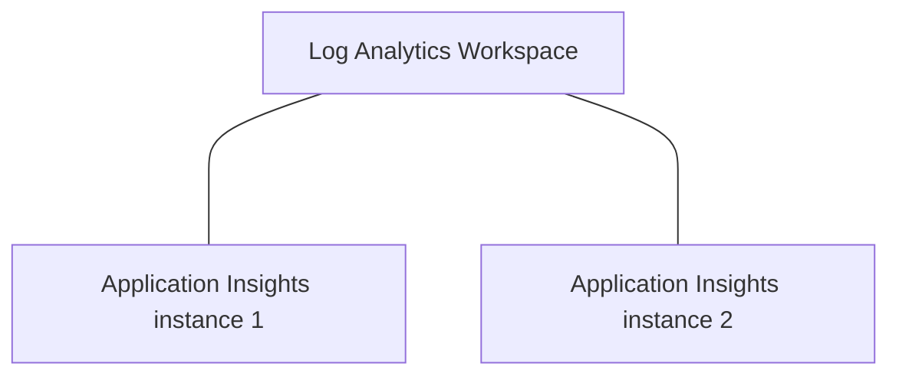

**On a recent project we encountered duplicate logging in Azure Application insights.**


:sunglasses: Sensitive information in the screenshots is blurred for obvious reasons.


## Problem introduction scope, and context
As seen in the screenshot we suffered in the acceptance environment with duplicate exceptions, information, and dependencies. In the development environment, on the left screen, we did not experience this issue.


### Plan to solve

To exclude the possibility of a software error we excluded these assumptions:

1. Debugging the application and looking at the outgoing application insights tab.
1. The Azure webapp / Azure function is misconfigured
1. We tested web apps with a single instance. If a single instance generates duplicate logging, it's surely not the instance count.

### The cause
The Log Analytics Workspace was configured in diagnostic settings as well it was in the properties of the Application Insights. See the screenshots of the Azure portal.


**The actual root cause** 

So when we concluded the configuration was duplicate, we asked ourselves:
Why was it duplicate configured, couldn't that have been spotted in an existing ARM template?

The answer consists of multiple factors and solutions. The two main components were an ARM-template and an Azure Policy.

#### 1. The correct way - ARM > Workspace property
For the, in my eyes correct, implementation of the properties it was filled by an ARM-template.
The infrastructure as code makes sure we're configuring the right Log Analytics Workspace.

```json {linenos=table}
{
    "type": "microsoft.insights/components",
    "kind": "other",
    "name": "ai-[YOUR-APPLICATION-INSIGHTS-NAME]",
    "apiVersion": "2020-02-02-preview",
    "location": "West Europe",
    "properties": {
        "Application_Type": "web",
        "ApplicationId": "ai-[YOUR-APPLICATION-INSIGHTS-NAME]",
        "WorkspaceResourceId": "law-[YOUR-LOG-ANALYTICS-WORKSPACE-NAME]"
    }
}
```

:bulb: The naming of Azure resources is done using the [Azure abbreviations guide](https://learn.microsoft.com/en-us/azure/cloud-adoption-framework/ready/azure-best-practices/resource-abbreviations).



#### 2. Azure Policy was enforced on 'Diagnostic settings'
There also was an Azure policy checking that there was a diagnostic setting for sending data to the Log Analytics Workspace.
Whenever the IT operations checked and enforced the Azure Policy, we would have duplicated the upstream to our Log Analytics Workspace.

## Conclusion

### Difference Application Insights and Log Analytics workspace



Application Insights gives 'insights' into application logging, exceptions, and such. You can use the Kudo query language to fetch data intelligently from Application Insights. The Log Analytics workspace is a set of tables. For the client in this article, the data of the Application insights was forwarded to the Log Analytics workspace. The advantage of the Log Analytics workspace is to query over multiple Application insights as well as data about other resources in azure, such as API management, application gateways, service busses, or firewalls.

In the screenshot below is seen that when you create a new Application Insights resource the Log Analytics Workspace is configured automatically.



:information_source: The Log Analytics workspace is part of the [Azure Monitor](https://learn.microsoft.com/en-gb/azure/azure-monitor/overview) component in Azure.



### Cost analysis :moneybag: 

This change saved the client over &euro;1000 monthly in Azure Log Analytic costs. The euros won't tell you how much of the total it was. After fixing all duplicate configurations, the total costs of the Application Insights resources were reduced by roughly 40-50%. If you also are experiencing this problem, I hope this article helps. Good logging makes all developers happy.

## Wrap up
Whenever you see duplicate logging in your application insights make sure the configuration is correct. Also, make sure that you're not forcing a policy on the diagnostic settings when you configure it in the properties. Only one upstream to the Log Analytic workspace is required :wink:.


### References

- [Microsoft Learn - Application Insights Duplicate Telemetry](https://learn.microsoft.com/en-us/answers/questions/883344/application-insights-duplicate-telemetry.html)
- [Converting table ApplicationInsights LogAnalytics ](https://learn.microsoft.com/en-us/azure/azure-monitor/app/convert-classic-resource#apptraces)
- [Azure Monitor](https://learn.microsoft.com/en-gb/azure/azure-monitor/overview)