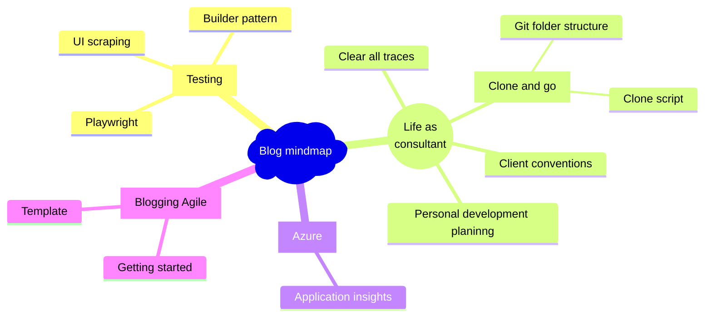

## TL;DR

Just start your creating your first page if you want to blog. Come back if you need motivation, then go back to writing/typing.

## Blog in an hour

My coworker said to me; "In the past time there was someone who did the things I dreamed of in just 4 days.". The person he referred to was me. He praised me for my dedication and courage to go fast and agile. I went fast to production with my blog and iterated new articles and new features. My coworker planned things out like the theme. When he was not fully satisfied with his theme he chose another theme but still had no active blog post. This blog is written to help others to get started.

## Focus on your first post

To break the chicken-egg problem, the focus for starting your blog should be creating the first post. If there is no content why should you make a blog? If there is no blog why should you make content? Break through the cycle and start creating your first article.

## Eat that frog

'Eat that frog' states that you should prioritize your tasks, and do the thing with the most impact first. You should be acting like there is no tomorrow and start working on your blog today, except when you don't want a blog. If you do not want a blog then why are you reading this article, are you procrastinating other tasks?

See your first article or blog post as the first checkpoint of your blogging world. From there you can check off multiple other checkpoints.

To read more about why you should do this now and not later, read my [Book review on Eat that frog]().

## One-time setup

I recommend using a blog builder that uses git versioning like Hugo. Hugo can be easily deployed. This blog runs on Azure Static Webapps and GitHub Pages. Other alternatives like Wix or WordPress will be more painful to maintain.

Just because this blog iterated to Azure Static Webapps, didn't stop me from producing the actual blog content. The blog content is the most valuable. It's the core reason for your blog to exist. People are coming to read what you have written not for your cool styling.

To make it agile I have made these acceptance criteria for your blog.

1. Your blog has to be accessible through the browser.
1. Your blog has at least one article.

That means that these things are **OUT OF SCOPE** for your **first** production release:

1. A custom URL
1. A funky-looking theme
1. A fitting Favicon
1. An about page.
1. Comment section
1. And so much more that gets in your way for your first blog post to be online.

## Iterating your blog

Iterating your blog should be about:

1. Finetuning your blogging workflow.
1. Styling your blog.
1. Refactoring your content.
1. Learning about the blogging framework.
1. Be fearless, when using Hugo and git you have version control to go back to. Just don't commit and push any secrets.

## Prioritize your blog TODO list

Make a list of items you want to blog about. When you get new ideas put them on the list and prioritize them. Start with your first item and focus on it until you finish that blog post!

Some questions to help you prioritize:

1. What blog item/subject has the most impact on your career? For example, if you write about a subject you work on daily, you will learn and become better. Another example is: you want to help companies using a certain technology. Writing about a subject helps your branding and the teacher learns the most.
1. What blog item/subject is hardest to solve?
1. What blog item/subject is not yet available easily when you searched for your problem?
1. What blog item/subject gives you the most joy?
1. What story do you tell about what you do for a living?
1. What do colleagues admire about you?

## Use a mindmap to organize your ideas

The mermaid JavaScript plugin builds some cool diagrams. Get started with your mindmap for blogging subjects right now with the [Mermaid Live Editor](https://mermaid.live/edit#pako:eNpdUk1PAjEQ_SuTniDBeN8YE1BvEojgxexl6M7uNm5naj9IVsJ_t7AsKj3N--jLy7QHpaUiVShruLLoSgbwInEyuRDT6YkCWHnTGA4DAHgVbqA1IYrvR64ojBae1Ag13u1EPqejshaXOvQmYDTCIwuw8Caa0IIbdHCh16100vSAKbbiYSvcwyJ94-XWGwVCr9sxY8VAdU06mj1TCA87f_-IXEFNGJOn8Mc3T1FsLqBBe7op8h5-rcN5Onv2BJF0y-Yr3Ro20WOkJse5DpkNN__1uW-SJY6Ql-iu6lakuwatieFU1qEjP5JL8hZNpWbKXqZCHU5iqWJLlkpV5LGiGlMXS1XyMVuTq3KZl8rk91BF9IlmKm9QNj3rEQ-eZ4ONRzuSDvlDJMMau5AxnSOWw584f43jDxofsC0). Below is an example mindmap of my blogging subjects.

## Conclusion

When starting your blog, focus on your content first. That's the thing that will be truly yours.

## References

- Please check out: [@ArnoPeters' blog](https://arnopeters.nl/)
