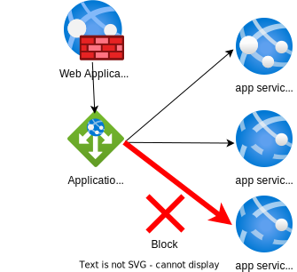

Let's say you have an application gateway deployed in Azure. Behind the application gateway are more than one backend services acting on requests for your costumers.



## Restricting access

When you want to release new code to production but still want it not exposed to the outside world, you can restrict access to the backend services by IP. This can be done by adding custom rules to your web application firewall policy (also WAF-policy).

### Adding custom rules in the portal

### Adding custom rules with a bicep template

```bicep
resource customRule 'Microsoft.Network/applicationGatewayWebApplicationFirewallPolicies' = {
  name: 'customRule'
  properties: {
    ruleType: 'MatchRule'
    ruleFormat: 'OWASP'
    ruleGroup: 'REQUEST-920-PROTOCOL-ENFORCEMENT'
    ruleId: '920350'
    ruleName: 'Block requests with empty user-agent header'
    action: 'Block'
    priority: 1
    ruleState: 'Enabled'
  }
}

```


# Solution
__Solution explained__
```cs {linenos=table}
__insert code here__
```

# Conclusion and discussion
__Solution explained__
```cs {linenos=table}
__insert code here__
```
