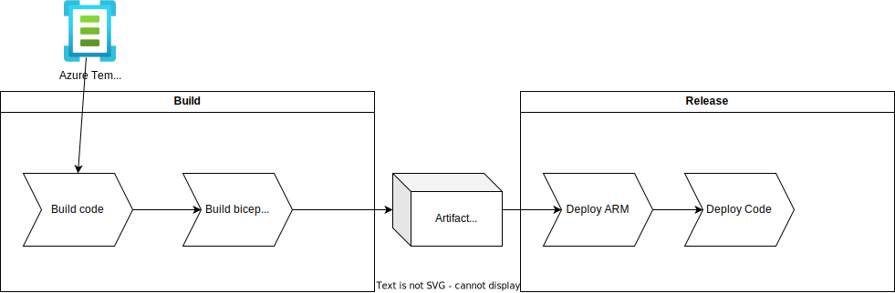

Let's say you have chosen to use Template Spec for your Bicep code. And you are using these Template specs as templates for your organization in your applications. Now you have a centralized place for your template specs. But you have also introduced a version dependency. Let's explore some challenges with this approach.

# Possible solutions

There are some choices that you can make:

- Always use the latest version of the template spec
- Use a specific version of the template spec

## Using Latest version

```bicep {file=templatespec-latest.bicep}
```

### Pros

You will always build on the latest version of the template specs, this allows you to freely use the latest features and fixes that are available in the template spec. New builds will automatically break when a breaking change is introduced in the template spec, so you have a quick feedback loop.

### Cons

When a template spec has a breaking change in the latest version, your deployment will break. This can lead to a lot of issues when critical applications are deployed.

A rollback of an earlier ran pipeline will be insufficient because when deploying bicep using templace spec it will then fetch again the latest version and will result in the same result as the latest deployment. In short, you will have no control.

## Using a specific version

```bicep {file=templatespec.bicep}
```

### Pros

You have full control over what version you are using for deploying your infrastructure. This allows you to test the new version of the template spec before deploying it to production.

### Cons

Updating versions for many applications can be a lot of work. When you have for example 100 applications that are using the template spec, you have to update all of them when a newer secure version is released.

This does happen some examples of this are:

- The application insights key is deprecated and connection string should be used.
- The 1.2 TLS was configured and now 1.3 should be the default.

These can be requirements by your company and you will have to update to comply to them.

# Considerations

## Use a specific version and use a dependency updater

What you could do is use a dependency updater like dependabot. This will automatically create a PR when a new version is available. This way you can review the changes. Just as if a colleague would update the template specs.

At the moment of writing this blog, bicep and template specs are not supported by dependabot. It is however already available for terraform, so i expect that the need for this will be there in the future. https://docs.github.com/en/code-security/dependabot/dependabot-version-updates/configuration-options-for-the-dependabot.yml-file#package-ecosystem

## Save the latest version build-time

Another option is when you build your application to build your bicep code to plain old ARM. This is a JSON-file that will be static when generated, and allows you to use the latest version at build time. You can rerun your old deployments using this static ARM teplate to get an consistent deployment.



One note this will not prevent unwanted errors in new builds, your application can still fail when a breaking change is introduced in the template spec.

# Conclusion

There is not a one size fits all but when you are using template specs in your organization you should think about how you want to handle the versioning of these template specs.

It can be a lifesaver to run latest versions when you have good tests in place in your CI/CD pipelines. But realise that you as a developer are taking a risk using this deployment method. When using a specific version you have more control but you will have to update all your applications when a new version is required.
