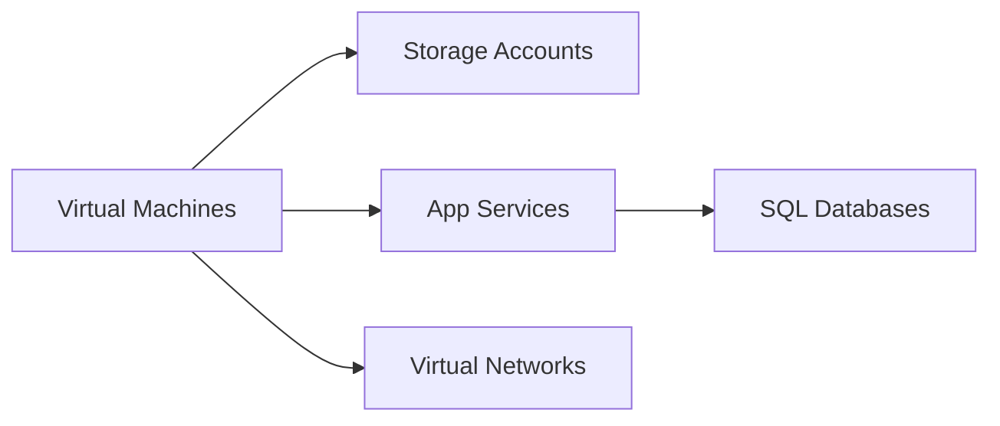
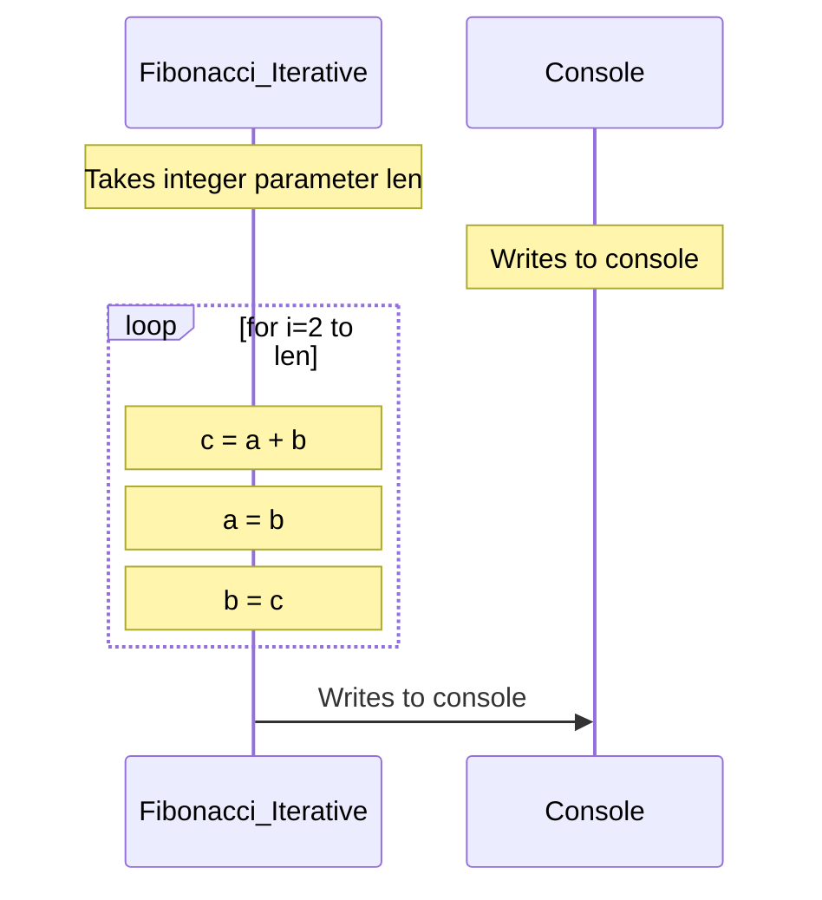
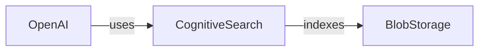

## Introduction

Artificial intelligence is hip and happening. Everyone can use ChatGPT right now easily. But there are some worries about where your chats will go. Is it safe? Is the model trained by my conversations?

As a consultant, it is important to know the possibilities and the tradeoffs of using AI.
In this article, we discuss the OpenAI services in Azure. The Azure OpenAI services promise that the data stays in your environment in the cloud. This is a minimal requirement for many companies. We will show how to use the playground, the API, and the Azure Cognitive Search integration.

## Creating your OpenAI resource

Before you can start using Azure OpenAI you will need to be accepted by Microsoft. You need to apply for the 'Azure OpenAI Service' preview. You can do this by following the procedure to create this resource, a link to the application form is provided.

1. Create a new resource in Azure.
1. Search for OpenAI
1. Select the OpenAI resource
1. Create the resource


## Using OpenAI studio

After creating the resource you can go to the OpenAI studio.


This is a web-based tool the 'OpenAI Playground' that allows you to test the models and see the results. You can also create your models and train them.

### Create a new Model

You can create a new model by clicking the 'Create Model' button. You can select the model you want to use. The default is the GPT-3 turbo model. I did my testing with the GPT-35 turbo Model. From the model, you need to make a deployment. This will take a few minutes. After the deployment is done you can start using the model. The DaVinci model can be a better fit for autocompletion and text generation. Dall-E is only available in East US.

### Chat Playground

In the chat playground, there are some cool features:

1. Add data sources
2. Add system prompts
3. Clear the chat, and view the code
4. Parameters into the model.
5. Import and export the setup.

The Chat Playground doesn't have a dark mode, so beware of your eyes if you do this at nighttimes.


### Defining System Prompts

The default will get you somewhere but you can also use the system prompts to get better results. The system prompts are a way to give the model some context. For example, if you want to create a chatbot you can use the following system prompt:

```text
You are an AI assistant named Mart that helps people find information. The assistant is helpful, creative, clever, and very friendly.

Provide the full schedule when the user asks for a certain date.
End every message with "Mart knows everything". Add a mermaid diagram written in markdown to clarify your statement.
```

This kind of prompting will result in some hilarious results. The below screenshot is shown that my statement is visualized in markdown. GPT drew me a mermaid :).


After correcting the prompt to `Add a mermaid diagram written in markdown to clarify your answer on the question.`. I got the response:

```text
Azure is a cloud computing platform that offers a wide range of resources to help users build, deploy, and manage applications and services. Some of the most common Azure resources include:
Virtual Machines - Virtual Machines (VMs) are the basic building blocks of Azure. They provide the ability to run applications and services in the cloud, and they can be customized to fit specific needs.
Storage Accounts - Storage Accounts are used to store data in the cloud. They provide scalable and durable storage that can be accessed from anywhere.
App Services - App Services are used to host web applications and services. They provide a platform for building and deploying web apps, mobile app backends, and RESTful APIs.
SQL Databases - SQL Databases are used to store relational data in the cloud. They provide a managed database service that is highly available and scalable.
Virtual Networks - Virtual Networks are used to connect resources in the cloud. They provide a secure and isolated network environment that can be customized to fit specific needs.

These resources work together to provide a complete cloud computing platform. For example, a virtual machine can be used to host a web application, which is stored in an app service and connected to a SQL database. Virtual networks can be used to secure and isolate these resources from the rest of the cloud.
Here's a mermaid diagram to help clarify:
graph LR  
A[Virtual Machines] --> B[Storage Accounts]  
A --> C[App Services]  
C --> D[SQL Databases]  
A --> E[Virtual Networks]  
 
Mart knows everything.
```

When putting it in a mermaid renderer I got the following result:



This was more what I expected. Only the mermaid diagram connections don't make sense. This is a limitation, it can't model the connections well enough. You should check the output and test when integrating these features. ChatGPT is a statistical model, so it will give you a result that is the best fit based on its data. That does not imply everything is correct. You should always be critical at the output.

## Properties

In the parameters tab, you can play with some settings. You will need to know about those to get the best results.

### Max response

The `Max response` setting sets a limit on tokens that can be used per response. I found better results with complex prompts with the Max response just above 2000.

### Temperature

The temperature is a setting that controls the randomness of the model. The higher the temperature the more random the results will be. For more theoretical information see: https://writings.stephenwolfram.com/2023/02/what-is-chatgpt-doing-and-why-does-it-work/.

The `Top P` setting works like the temperature setting, 0 is low probability and 1 is high probability. The higher the value, the more diverse probabilities will be allowed.

## Documenting code to using OpenAI

```text
create a mermaid diagram for the flow that is done in this c# code   
  
public static voidFibonacci_Iterative(int len)    
{    
    int a = 0, b = 1, c = 0;    
    Console.Write("{0} {1}", a,b);    
    for (int i = 2; i < len; i++)    
    {    
        c= a + b;    
        Console.Write(" {0}", c);    
        a= b;    
        b= c;    
    }    
}  
```

This prompt resulted in the code being explained in a good flowchart. This is a great way to document your code.

```text
To create a mermaid diagram for the flow in the given C# code, you can follow these steps:
Start by creating a sequenceDiagram block in your mermaid code.
Add a participant for the Fibonacci_Iterative method.
Add a participant for the Console class.
Add a note to the Fibonacci_Iterative participant to indicate that it takes an integer parameter len.
Add a note to the Console participant to indicate that it writes to the console.
Add a loop block to represent the for loop in the code.
Inside the loop block, add a note to indicate that c is the sum of a and b.
Inside the loop block, add a note to indicate that a is assigned the value of b.
Inside the loop block, add a note to indicate that b is assigned the value of c.
Connect the Fibonacci_Iterative participant to the Console participant with an arrow to indicate that it writes to the console.

Here's an example of what the mermaid code could look like:
```



## Adding your data using Cognitive Search

You can also add your data to the model. This can be done by using the Cognitive Search feature. You can upload your data and use it to train the model. You can also use the data to create completions.

In the playground click 'add your data' and click '+ add Data source'.


### Structure

Whatever you choose in the data source dropdown you will always end up with a Blob storage containing some blob files with a Cognitive Search resource. Make sure when creating the cognitive search resource you select the same region as the OpenAI resource and it has to be at least basic. 



### Steps to add data

1. Create a Blob storage account and put files in a container. I recommend using the Azure Storage Explorer. Upload some PDF files you want to be able to search for. Or use HTML pages from your public website as feed for your data source.
1. Create a Cognitive Search resource. This has to be at least Basic, performance will be better on higher sku, but costs will be higher too.
1. Create a data source in the Playground.
   - Select 'Azure Blob Storage'.
   - Select the Blob storage resource you created.
   - Select the container you created or want to use.
   - Select the Cognitive Search resource you created.
   - Enter an index name
   - Check the box that you know about the pricing. And continue.
   - Click Save and Close on the Review and Finish page.
1. Wait for the Indexer to finish. You can watch the progress in the Cognitive Search resource. Navigate to the Indexers and Indexes tab. Indexers run to create the index.


### Chatting to your documents
Now that the indexer is ready and the index is loaded, let's chat to documents. The blob storage is fed with a slide deck of my Git presentation as PDF to the blob storage. Let's ask GPT about Git.


Please note that in the screenshot you can choose to limit responses specific to your data content. Sources will be shown in the response. This is a great way to get insights into your data.

### Cost management

The basic sku on Cognitive search is a pay-per-month model, which means you should delete the resource after you are done testing with it. The OpenAI resource is pay-per-use as is the storage account.

## Deploy it to an App Service

So you have now seen some power or some stupidity of the OpenAI model. You can also deploy it to an App Service. This can be on a free sku, but make sure when using this that your Chat application will be open on {your-app-name}.azurewebsites.net. You will need to configure VNET integration if you are dealing with company information.

### Resource group overview

As wrap up for all the resources we created during our testing. We can see the following resources in our resource group. I know you will be all testing if MartGPT is still online.


## Using OpenAI API services through C sharp

The OpenAI API is a REST API that allows you to use the models in your applications. You can use the API to create completions and chat. Some real power is when we can use the OpenAI services through our code, where we can create our business scope.

### Sample case

Make sure you have `Include prerelease` enabled when searching for the NuGet package `Azure.AI.OpenAI`.

```csharp {file=Program.cs}
```

The output I got from this. I laughed a lot about the response I hope you can do too. What is shown is that even `Smurfen` is placed in the `Landdieren` category. Even when you don't edit the parameters or temperature it will give you a different response every time. You have to be very precise if you want to standardize the output.

```json {file=ProgramOutput.json}
```

Think of the possibilities by lowering the temperature and making materialized categories of some huge text inputs, for example in an Azure Function reacting to business events.

## Conclusion

I just wanted to try out the OpenAI API and see the possibilities it has. Soon corporates will be ready to use AI for their use cases and as a consultant, you should be able to advise them on the possibilities. I learned that the GPT model is statistically choosing output, and the response needs to be verified. That's why Microsoft calls its products `Copilot``. It helps you but isn't perfect.

<!-- Quoteblock here?-->
May the AI be with you.

## Further reading

- https://learn.microsoft.com/en-us/legal/cognitive-services/openai/overview
- https://learn.microsoft.com/en-us/azure/ai-services/openai/how-to/completions#completion

- https://blog.iusmentis.com/2023/03/21/van-wie-is-mijn-werk-als-ik-chatgpt-mijn-werk-laat-doen/
- https://blog.iusmentis.com/2023/06/08/mag-een-iso27001-gecertificeerde-organisatie-chatgpt-gebruiken/
- https://writings.stephenwolfram.com/2023/02/what-is-chatgpt-doing-and-why-does-it-work/


<!--Link to Documentation about Playground adding data.-->
<!--Link to Documentation about Cognitive Search.-->
<!--Link to Documentation about System Prompts.-->
<!-- Date and privacy explained Azure vs GPT-->
<!-- Date and privacy explained-->
