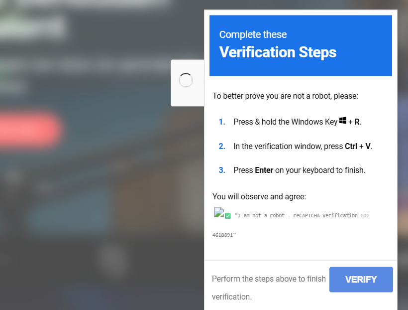
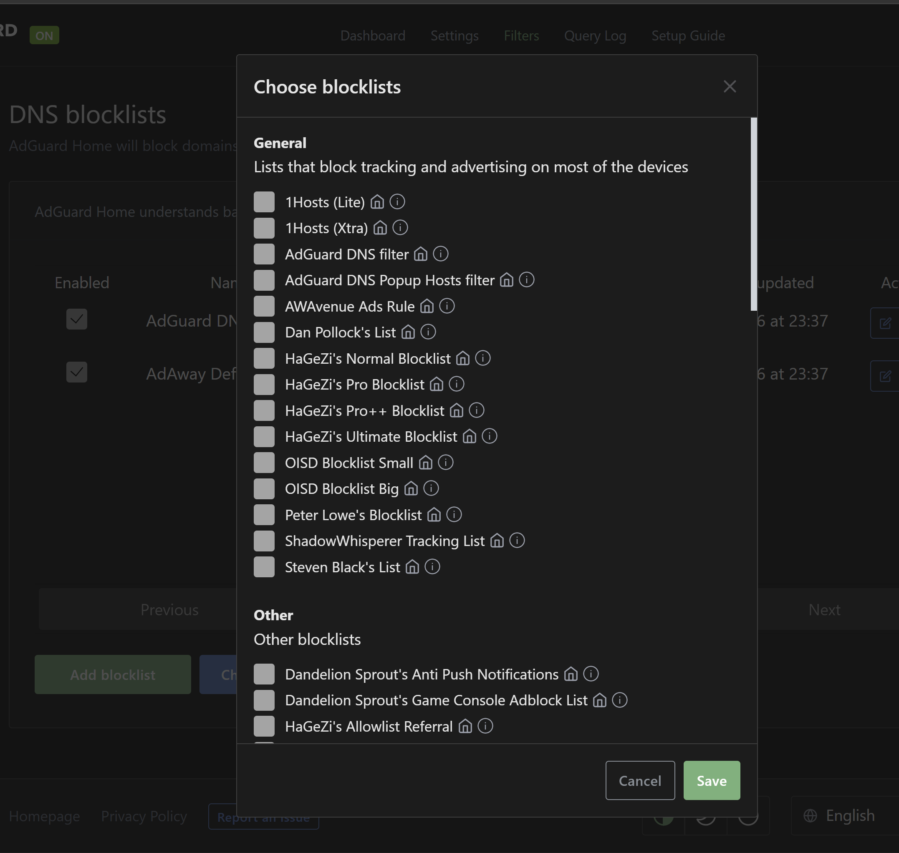

On my free day i received a message on my work account my laptop was isolated because of ransomware. I was confused because i thought i didn't do anything wrong. After some investigation i found out that i got fooled by a ClickFix. In this blog post i will share my experience and what i learned from it, and what you can do to protect yourself and family from similar attacks.

## What is a ClickFix?

A ClickFix is a type of cyber attack that tricks users into executing malicious code on their own devices. It typically involves a fake error message, such as a fake captcha or an update prompt, that convinces the user to copy and paste a script into the Windows 'Run' dialog (Win + R). This can lead to unauthorized access, data theft, or other harmful consequences.

## How did you find out you were a victim of a ClickFix?

For the podcast Oogkleppen i was scouting people to interview. I got told to get somebody who has built up a company at a young age. I found the person on LinkedIn and reached out in DM. After the person agreed I went to their website to find out more about them. Their website got hacked and was showing a fake captcha. I was sleepy and enthusiastic about the interview, so I didn't think twice and copied the script into the 'Run' dialog. After that I got a message that my computer was Isolated by the Security Operations Team. I had 6 hours wasted because they needed to reinstall my computer.

## Feeling stupid

The security engineer told me to not feel stupid, but you know, you will feel stupid after seeing what you did. I want to prevent people making the same mistake, that's why I am sharing my experience. 

## Protecting Yourself and Your Family

I have Home Assistant running. On Home Assistant there is a thing called 'AdGuard Home' which is a network-wide ad blocker. It helps the kids to not see ads while playing games on tablets. To block ClickFixes, the security engineer told me to include more blocklists especially the ones from 'HaGezi'. This is done easily by adding the blocklists to AdGuard Home. By doing this, I can prevent my family from falling victim to similar attacks in the future.

The security engineer noticed that the domain even changed every day, HaGezi's list blocked that domain as well. The new domain was just registered, so that was a real sneaky strategy.

## Conclusion

I learned a lot, wasting 6 hours on letting the laptop reinstall and feeling stupid. Let's make sure that you don't put anything in the Run window you don't trust and block those domains.

- [HaGezi DNS Blocklists on GitHub](https://github.com/hagezi/dns-blocklists)
