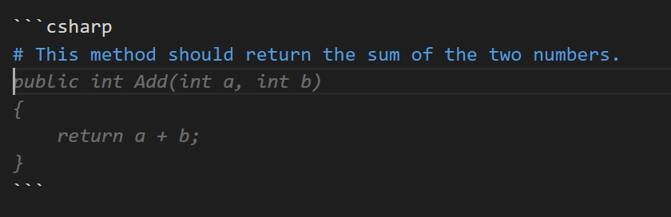
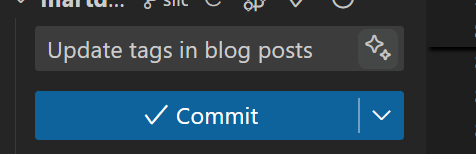
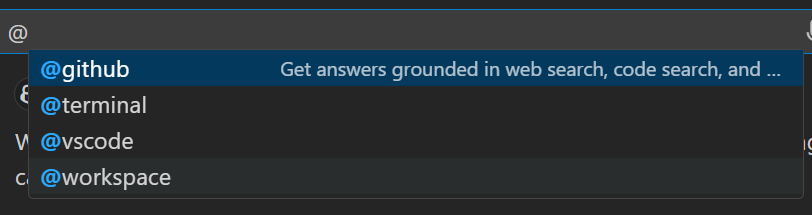

GitHub Copilot has made his way into your daily life. For many developers habits are made, but please use the feature that suits your case best. Don't use the Chat or completion as golden hammer for every problem.

The goals in this post are to make you aware of the possibilities and to make you think about how you should look at tools such as GitHub Copilot.

## GitHub Copilot

GitHub Copilot is super cool. Lets see those features!

### Chat

The chat feature in VS or VS Code. It's ChatPGT with knowledge of your code. It's handy to get a quick answer to a question. It's not a golden hammer for every problem. What is the difference when u ask it to do something and you are still copy pasting code?

The chat window can be a big part of your screen, be aware of that.

### Code completions

Use a comment to get a completion. When entering the code will appear.


You should know by the way that you can also use only the beginning of the suggestion.

Use `Ctrl + right arrow` to accept one word at the time of the completion.

### Inline chat

For example using `Ctrl + i` in VS Code. It will give you a completion for the line you are on.

```txt
/tests
/fix
/explain
/docs
/help
/optimize
/generate
```

#### Chat pallete

Use `Ctrl + Shift + I` in VS Code to open the chat in a pallete. This is handy to get a quick chat while keeping focus on your code.

To close the chat pallete, use `Esc`.

### Commit message generation

use the Stars to generate a commit message. It's a good way to save time thinking of a commit message.


### Reference a file/method in a prompt

Use the `#` prefix to reference a file in your prompt.

```txt
/fix This method should return a #Address.cs
```

### Reference a scope

Use the `@` prefix to reference a file in your prompt.



### Prompting

Your prompt is is key for good results. You should be clear in what you want to achieve.

If your first prompt is not giving you the results you want, try to be more specific.

## Code worthy

Let me give you a statement:

> Code is less valuable if it's generated by a tool.

That is a bold statement. I think it's true. The engineers should be aware of the problem and the solution. The tool can help you with the implementation.

### Engineers are puppeteers

The software engineers of the next years are going to tell the story using their puppets. The management will see output of the tooling and think they can do without the engineers. The technology is not there yet, but i think the engineers without the use of AI tooling will be pruned, just like variants in Loki, the Marvel series.

## Conclusion and discussion

I Like to have focus and not be distracted by the chat window. I think you should use the feature that suits your case best. For generating tests for example i think its best to do it inline, and accept the completion afterwards instead of copy pasting parts of the code.

I also think you should be reading release notes of GitHub Copilot. It's a tool that is constantly evolving. It's good to know what the changes are.

## References

- [https://learn.microsoft.com/en-us/visualstudio/ide/copilot-chat-context?view=vs-2022](https://learn.microsoft.com/en-us/visualstudio/ide/copilot-chat-context?view=vs-2022)
