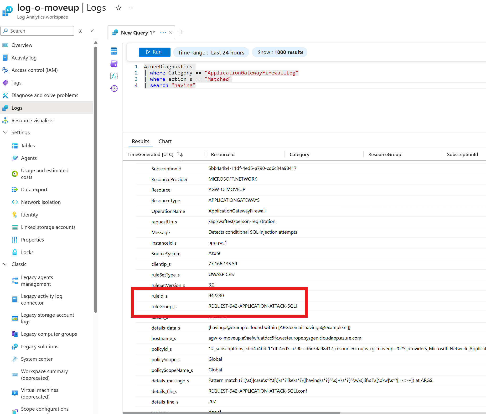

You implemented an Application Gateway with Web Application Firewall (WAF) in front of your web applications in Azure. Everything seems to be working fine, but suddenly you notice some issues. Maybe some users report that they cannot access the application, or you see unusual traffic patterns in your logs. In this blog, we will discuss how to troubleshoot common issues with Application Gateway in production.


:door: All the things mentioned are closely related to the WAF used for Azure Front Door.


## Mr Havinga

Imagine you are Mr. Havinga, the IT manager of a medium-sized company. You want to buy a new phone, but when you try to access the online store, you get a 403 Forbidden error. You are blocked! The firewall blocked you because the request matched a WAF rule. HAVING is a SQL keyword the WAF triggered a SQL Injection rule.It is extremely important to identify false positives and tune your WAF rules accordingly to prevent blocking legitimate traffic.


:face_with_peeking_eye: "Mr Havinga is not *having* a good day."


## 403 Forbidden

When users report that they receive a 403 Forbidden error when trying to access the application, it is often due to WAF rules blocking legitimate traffic.


### Application Insights doesn't know

When a request is blocked by the WAF, it may not be logged in Application Insights. This can make it difficult to troubleshoot issues, as you won't see any telemetry for the blocked requests. To get around this, you can enable diagnostic logging for your Application Gateway. This will log all requests, including those blocked by the WAF, to your Log Analytics workspace. You will need to search on the log analytics workspace and not in the application insights resource to get a full picture of the situation.


🤓 The Log Analytics workspace is your friend here. it contains all the logs you need to troubleshoot WAF issues.


### Watch out for generalisation

In a project there was builtin that when the frontend received a 403 on *any* request it would redirect to the login page. It was extremely frustrating because the page it happened on was anonymous. After investigation we found out that the WAF was blocking some requests because of false positives. The redirection to the login page made it seem like an authentication issue, while it was actually a WAF issue.

If you have this aswell, you can edit the code to show a specific error message when a 403 is received from the Application. Here is an example of how to do this in bicep for the WAF policy. Let's make it more fun by changing the status code to 418 (I'm a teapot) instead of the standard 403.

```bicep
policySettings: {
  resource applicationGatewayWAFPolicy 'Microsoft.Network/ApplicationGatewayWebApplicationFirewallPolicies@2024-10-01' = {
  name: 'WafPolicy'
  location: 'West Europe'
  properties: {
    policySettings: {
      customBlockResponseStatusCode: 418
      customBlockResponseBody: 'Oops! Your request was blocked by the WAF. But don\'t worry, I\'m just a teapot!'
      mode: 'Prevention'
    }
  }
}
```

## Investigate in your log analytics workspace

First, check the logs in your Log Analytics workspace. Look for entries that indicate blocked requests. You can filter the logs by status code 403 to see which requests were blocked.

```kusto
AzureDiagnostics
| where Category == "ApplicationGatewayFirewallLog"
| where action_s == "Blocked" or action_s == "Matched"
| order by TimeGenerated
```

It is important to know that the WAF logs are logging Matches and Blocked actions together and will Block if the after 'Inbound Anomaly Score Exceeded (Total Score: 5)'.



## Identify the blocking rule

Once you have identified the blocked requests, look for the `ruleId_s` field in the logs. This field indicates which WAF rule blocked the request. You can then look up this rule in the [OWASP ModSecurity Core Rule Set](https://coreruleset.org/) to understand why it was triggered.

To know more about the specific rule that was triggered, you can see the list on [Microsoft Docs](https://learn.microsoft.com/en-us/azure/web-application-firewall/ag/application-gateway-crs-rulegroups-rules?tabs=drs21%2Cowasp32).

## Create an exclusion rule

If you determine that the blocking rule is causing false positives, you can create an exclusion rule in your WAF policy. This allows you to exclude specific requests from being evaluated by certain rules.

```bicep {linenos=table,file="waf.bicep"}
```

## Conclusion

By identifying false positives and creating exclusion rules, you can ensure that legitimate traffic is not blocked while still protecting your applications from threats. This is also the reason why I always recommend starting with a WAF in detection mode first, to monitor and tune the rules before enforcing them via prevention mode.

## More reading

- https://alanta.nl/posts/2021/04/manage-waf-rules-for-appgateway
- https://docs.microsoft.com/en-us/azure/web-application-firewall/ag/custom-waf-rules-overview