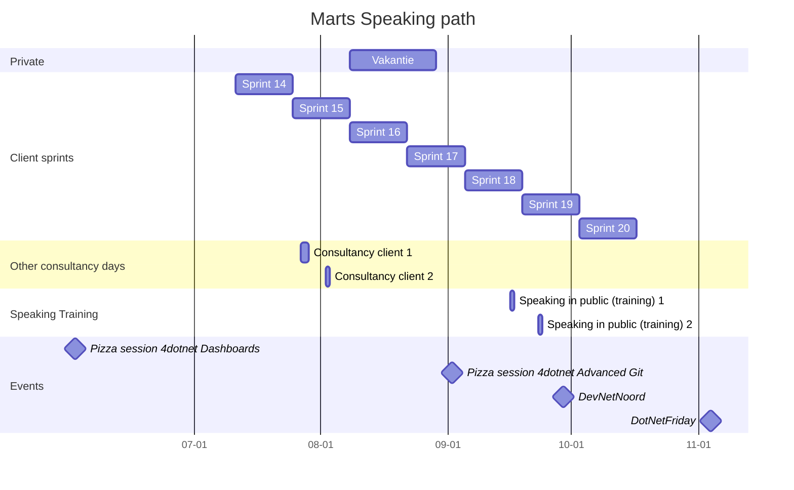

This year I read and listened to 'Eat that frog!' by Brian Tracy. I tried to apply these principles to my daily life.


:bulb: This article will be updated when I find new takeaways.


## Summary

Eat that frog is a practical book on how to "get more of the important things done today". It focuses on doing key tasks first and procrastinating the unimportant tasks.

The author gives 21 principles for getting more things done faster:

01. Set the table (spend some time writing out your goals for year, month, and week). Prioritize those and concentrate on the most important ones.
02. Plan every day in advance (on paper).
03. Apply the 80/20 rule to everything: 20% of your work will constitute 80% of your achievements. Concentrate on that 20%.
04. Consider the consequences of what you choose to work on. Focus on these above all else.
05. Practice creative procrastination. You're not going to be able to get everything done so put off the less important tasks.
06. Use the ABCDE method. Organize your tasks by value (a,b,c...) and priority (1,2,3...).
07. Focus on key result areas.
08. Obey the law of three. Identify the three things you do in work that account for 90% of your contribution.
09. Prepare thoroughly before you begin. The 6Ps: Proper Prior Planning Prevents Poor Performance.
10. Take it one barrel at a time. That way you can make it through the desert.
11. Upgrade your key skills!
12. Identify your key constraints.
13. Put pressure on yourself.
14. Motivate yourself into action (be your own cheerleader).
15. technology is a terrible master. Take back time your time from tech addictions. Learn to turn off devices and notifications and keep them off.
16. Technology is a wonderful servant. Use technological tools to confront yourself with what is most important.
17. Focus your attention
18. Slice and dice your tasks. Break your tasks into smaller, more manageable chunks.
19. Create large blocks of time to get your work done.
20. Develop a sense of urgency.
21. Single-handle every task.

## Comparing Agile and the lecture in Eat that frog

I see many aspects that are similar in working Agile as what is stated in 'Eat that frog'. For example:

- (6) Use the ABCDE Method Continually (The Product owner should keep the backlog up to date)
- (7) Focus on key result areas (The work in the sprint)
- (9) Prepare thoroughly before you begin (refinements)
- (18) Slice and Dice the Tasks (The division of Epic Feature and Product backlog, and task level)
- (20) Develop a sense of urgency (The sprint is time-boxed)

## Lessons learned as a developer

Think about your daily, weekly, monthly, and long-term goals.
Make sure you check your daily goals with your long-term goals.
I did write down my long-term goals on paper and am trying to work with daily TODO lists.


:speech_balloon: "Find out what successful people do, and do the same things until you get results."

__Quote from the book__


### Example long-term goals

1. I am certified in security in 2023.
1. I am speaking on stage as a public speaker in 2023.
1. I am 90kg or less in November 2023.

Important is to write your goals in the present tense, positive voice, and in the first person singular. This way your mind will accept it as a clear goal.

For each of these goals, create a list of work you have to do to achieve your goal. When you break down your goal into tasks it will be easier to do.

I did this for example for my speaking goals. This gantt chart below was my planning for 2022. The main goal was to be prepared for DevNetNoord, a Dutch tech event.
When I determined my goal I placed tasks that could help me prepare for this event, such as training or smaller sessions.

## Recommendations

I recommend reading or listening to this book and practicing some of the given habits. One that will highly depend on the individual is: 'Upgrade your key skills'. I think you should be making goals to keep learning next to your daily work. Sometimes even before doing any daily work. The learning will increase your efficiency especially when you focus on a key skill.

### Listen on Spotify


