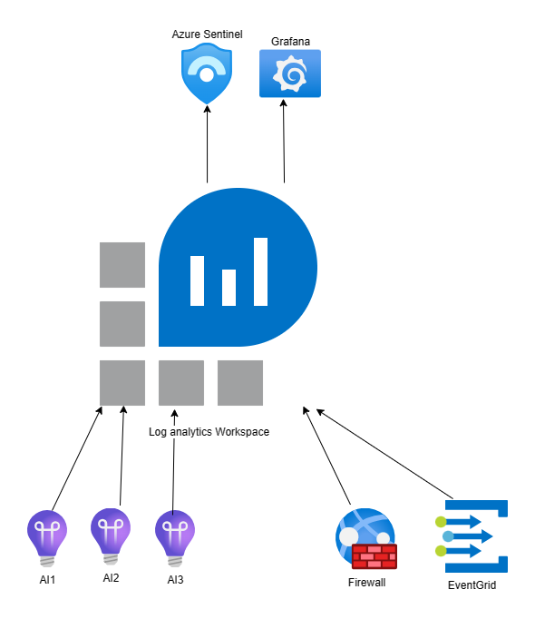

+++
weight = 1
+++

{}

{}

A Log Analytics Workspace has upstream connectors and can be used to write diagnostics to by Application Insights and azure resources

Some upstream resources:

- Power BI
- Grafana
- Azure Defender for Cloud
- Azure Sentinel
- Azure Dashboards
- Azure Workbooks

Costs are per Gb in the LAW, so scaling AI will not affect costs.

see also: https://blog.martdegraaf.nl/posts/azure-application-insights-in-control-of-costs/

{}

---

## Basic Azure Application Insights

1. requests
1. traces
1. exceptions
1. dependencies
1. pageViews

{}
Deze tabellen vertalen in Log Analytics Workspace naar andere tabelnamen.
{}

---

## Azure Log Analytics workspace

| appi | LAW |
|---|---|
| requests | AppRequests   |
| traces | AppTraces |
| exceptions | AppExceptions   |
| dependencies | AppDependencies |
| pageViews |  AppPageViews |

{}
https://learn.microsoft.com/en-us/azure/azure-monitor/reference/tables/tables-category
{}

---

## Kusto in Microsoft Azure

1. Azure Application Insights and Log Analytics
2. Azure Monitor
3. Azure Resource Graph Explorer

{}
https://en.wikipedia.org/wiki/Azure_Data_Explorer
Wikipedia says Kusto from 2014, and names after the person Cousteau, as a reference to searching in the ocean of data.
{}

---

## Azure Data Explorer

### Kusto Query Language (KQL)

1. <https://learn.microsoft.com/en-us/azure/data-explorer/kusto/query/>
2. <https://learn.microsoft.com/en-us/azure/data-explorer/kusto/query/sqlcheatsheet?source=recommendations>

{}
