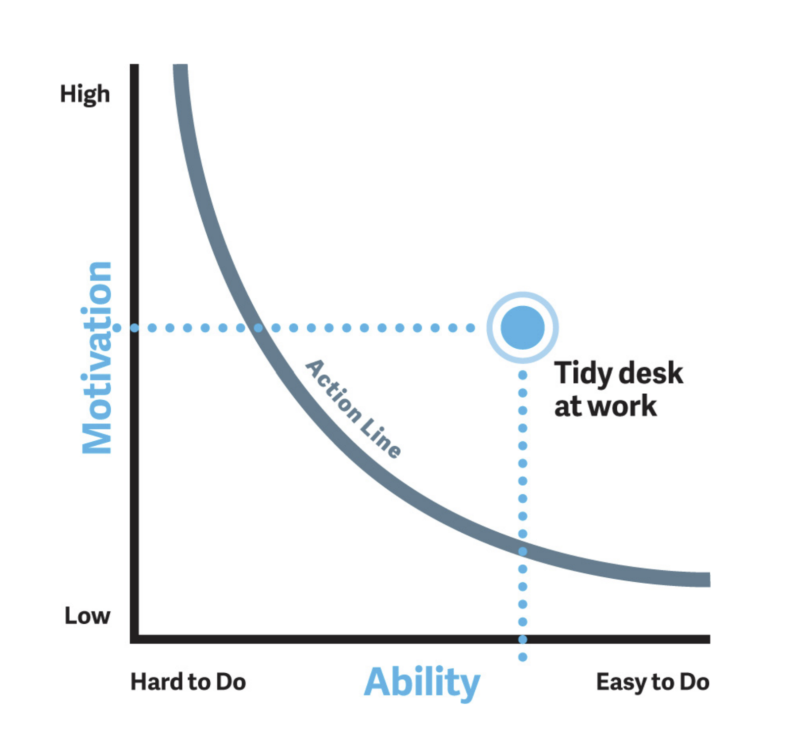
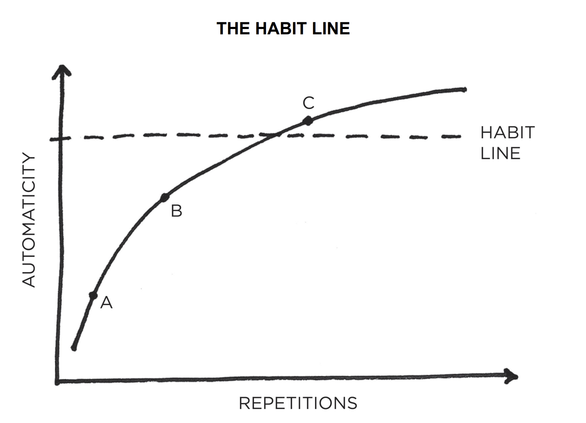
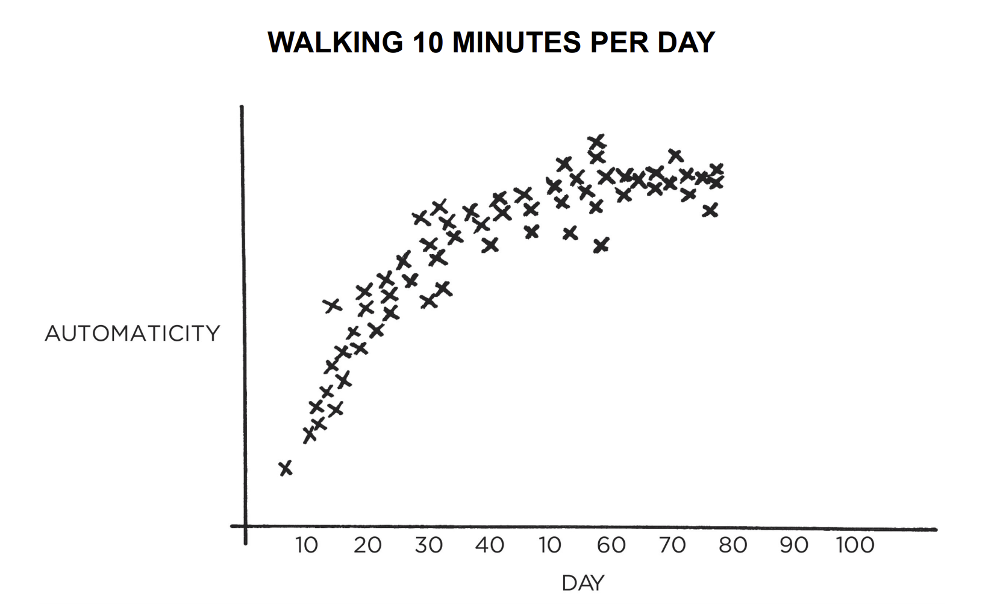

+++
title = "Git"
outputs = ["Reveal"]
author = "Mart de Graaf"
[logo]
src = "/images/4dotnet_logo.png"
diag = "2%"
+++

# Git

---

{}

## Agenda - ochtend

- 09:00 | Inloop
- **09:30 - 10:00 | Introductie en doelstellingen**
- **10:00 - 11:00 | git stages**
- **11:00 - 12:00 | Merge vs Rebase**
- **12:00 - 12:30 | Lunchpauze**

---

## Agenda - middag

- **12:00 - 12:30 | Lunchpauze**
- **12:30 - 13:30 | Commit ethiek**
- **13:30 | Git Non-common Features - Git LFS & Git Submodules**
- **14:00 | Geschiedenis en commits terugdraaien en Cherry picking**
- **14:00 | Clone HTTPS vs SSH**
- **15:00 - 16:00 | VS Code & Git Fork**
- **16:00 | Afronding**

{}

{}

## Commit ethiek

---

### Fogg behavior Model

---

{}

## B = MAP

Behaviour _happens when_ Motivation x Ability x Prompt _converge at the same moment_.

---

{}

<section>

<!-- TODO make the images animated -->
<section data-noprocess>
    
    <p>Image from Tiny Habits</p>
</section>

<section data-noprocess>
    
    <p>Image from Tiny Habits</p>
</section>
</section>

---

{}

## Habit line



---

## Habit line 2



---

## Gewoontes

- Eén commit per wijziging
- Ik bekijk mijn changes voordat ik commit
- Ik bekijk mijn PR voordat ik hem ter review aanbied
- Ik zorg dat mijn PR's niet te groot zijn
- Ik zorg dat mijn PR's niet te lang open staan
- Een change per branch

---

## Convensies

- Branch naamgeving bijv: [naam]/[feature]
- Commit messages bijv [chore] [feature] [fix]

[github.com semantic commits](https://gist.github.com/joshbuchea/6f47e86d2510bce28f8e7f42ae84c716)

Heel dicht tegen semantic versioning aan.
Major.Minor.Patch

---

## Beschrijvende git commits

Wel: `Kort en bondig, bijvoorbeeld: "Voeg validatie toe aan invoerveld."`

Niet: `Nog een fix.`

---

## Boehm's law


{}

https://paulhammant.com/2012/11/01/testability-and-cost-of-change/

{}

---

## ADR's

Architectural Decision Records

Vastlegging van het waarom

Voorbeelden:
https://github.com/joelparkerhenderson/architecture-decision-record/tree/main/locales/en/templates/decision-record-template-of-the-madr-project

{}

---

{}

## Git LFS

Git Large File Storage (LFS) is a Git extension for versioning large files.

---

### Why use Git LFS?

- Handles large files efficiently
- Reduces repository size
- Improves performance

---

### How it works

1. **Pointer files**: Replaces large files with small pointer files.
2. **Storage**: Large files are stored on a remote server.

---

### Installing Git LFS

```sh
git lfs install
```

---

### Tracking files with Git LFS

```sh
git lfs track "*.psd"
```

---

### Committing files

```sh
git add .gitattributes
git add file.psd
git commit -m "Add design file"
```

---

### Pushing to remote

```sh
git push origin main
```

---

### When not to use Git LFS

- Small files: Regular Git handles small files efficiently.
- Frequently changing files: LFS can increase the repository size if large files change often.
- Binary files that don't benefit from diffing: LFS is less useful for files that don't benefit from version control diffing.

---

### Resources

- [Git LFS Documentation](https://git-lfs.github.com/)
- [Git LFS Tutorial](https://www.atlassian.com/git/tutorials/git-lfs)


{}

---

{}

## Git Submodules

---

### What are Git Submodules?

Git Submodules allow you to keep a Git repository as a subdirectory of another Git repository. This lets you clone another repository into your project and keep your commits separate.

---

### Why use Git Submodules?

- **Modularization**: Keep related projects together while maintaining separate version histories.
- **Reuse**: Share common code across multiple projects.
- **Isolation**: Manage dependencies without merging histories.

---

### Adding a Submodule

```sh
git submodule add https://github.com/username/repository.git path/to/submodule
```

---

### Cloning a Repository with Submodules

```sh
git clone --recurse-submodules https://github.com/username/repository.git
```

---

### Updating Submodules

```sh
git submodule update --remote
```

---

### Removing a Submodule

1. **Remove the submodule entry from `.gitmodules`**:
    ```sh
    git rm --cached path/to/submodule
    ```

2. **Remove the submodule directory**:
    ```sh
    rm -rf path/to/submodule
    ```

---

### Common Issues

- **Detached HEAD**: Submodules are often checked out to a specific commit, not a branch.
- **Synchronization**: Ensure submodules are updated to the correct commit.

---

### Resources

- [Git Tools - Submodules](https://git-scm.com/book/en/v2/Git-Tools-Submodules)
- [Git Submodule Documentation](https://git-scm.com/docs/git-submodule)


{}

---

{}

## Git Clone: HTTPS vs SSH

---

### Cloning with HTTPS

```sh
git clone https://github.com/username/repository.git
```

- **Pros**:
    - Easier setup
    - Works behind most firewalls and proxies
- **Cons**:
    - Requires entering username and password for each push/pull
    - Less secure than SSH

---

### Cloning with SSH

```sh
git clone git@github.com:username/repository.git
```

- **Pros**:
    - More secure
    - No need to enter credentials for each push/pull
- **Cons**:
    - Requires SSH key setup
    - May be blocked by some firewalls

---

### Setting up SSH Keys

1. **Generate SSH Key**:
        ```sh
        ssh-keygen -t rsa -b 4096 -C "your_email@example.com"
        ```

2. **Add SSH Key to SSH Agent**:
        ```sh
        eval "$(ssh-agent -s)"
        ssh-add ~/.ssh/id_rsa
        ```

3. **Add SSH Key to GitHub**:
        - Copy the SSH key to clipboard:
            ```sh
            cat ~/.ssh/id_rsa.pub
            ```
        - Add the key to your GitHub account under **Settings > SSH and GPG keys**.

---

### Switching Remote URL from HTTPS to SSH

```sh
git remote set-url origin git@github.com:username/repository.git
```

---

### Resources

- [GitHub: Connecting to GitHub with SSH](https://docs.github.com/en/authentication/connecting-to-github-with-ssh)
- [Git: Working with Remotes](https://git-scm.com/book/en/v2/Git-Basics-Working-with-Remotes)


{}

---

{}

## Git Reset

---

### What is Git Reset?

Git Reset is a powerful command used to undo changes in your working directory and staging area.

---

### Types of Git Reset

1. **--soft**: Moves the HEAD pointer to a specified commit, but leaves the staging area and working directory unchanged.
    ```sh
    git reset --soft <commit>
    ```

---

2. **--mixed** (default): Moves the HEAD pointer and updates the staging area to match the specified commit, but leaves the working directory unchanged.
    ```sh
    git reset --mixed <commit>
    ```

---

3. **--hard**: Moves the HEAD pointer, updates the staging area, and changes the working directory to match the specified commit.
    ```sh
    git reset --hard <commit>
    ```

---

## Git Checkout

---

### What is Git Checkout?

Git Checkout is used to switch between branches or restore working tree files.

---

### Switching Branches

```sh
git checkout <branch>
```

---

### Creating and Switching to a New Branch

```sh
git checkout -b <new-branch>
```

---

### Restoring Files

```sh
git checkout -- <file>
```

---

## Git Log

---

### What is Git Log?

Git Log displays the commit history of a repository.

---

### Basic Usage

```sh
git log
```

---

### Customizing Git Log Output

- **One-line summary**:
    ```sh
    git log --oneline
    ```

- **Graphical representation**:
    ```sh
    git log --graph
    ```

- **Specific author**:
    ```sh
    git log --author="Author Name"
    ```

---

## Git Show

---

### What is Git Show?

Git Show displays information about a specific commit.

---

### Viewing a Commit

```sh
git show <commit>
```

---

### Viewing Changes in a Commit

```sh
git show --name-only <commit>
```

{}

---

{}

## Git Cherry-pick

---

### What is Git Cherry-pick?

Git Cherry-pick applies the changes from a specific commit to the current branch.

---

### Applying a Commit

```sh
git cherry-pick <commit>
```

---

### Resolving Conflicts

If conflicts occur during cherry-picking, resolve them manually, then continue:
```sh
git cherry-pick --continue
```

---

### Aborting Cherry-pick

To abort a cherry-pick in progress:
```sh
git cherry-pick --abort
```

{}