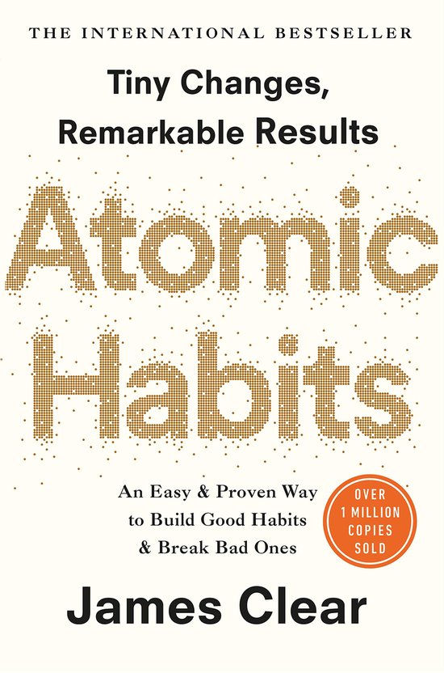
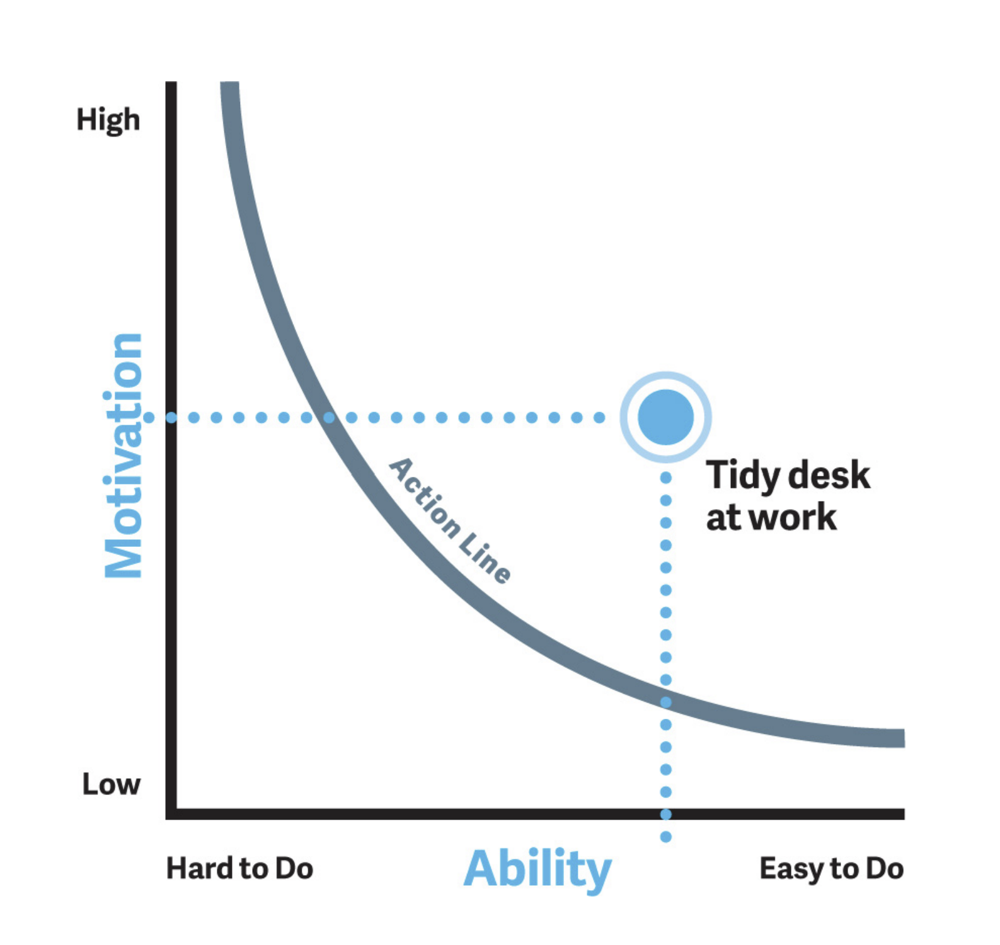
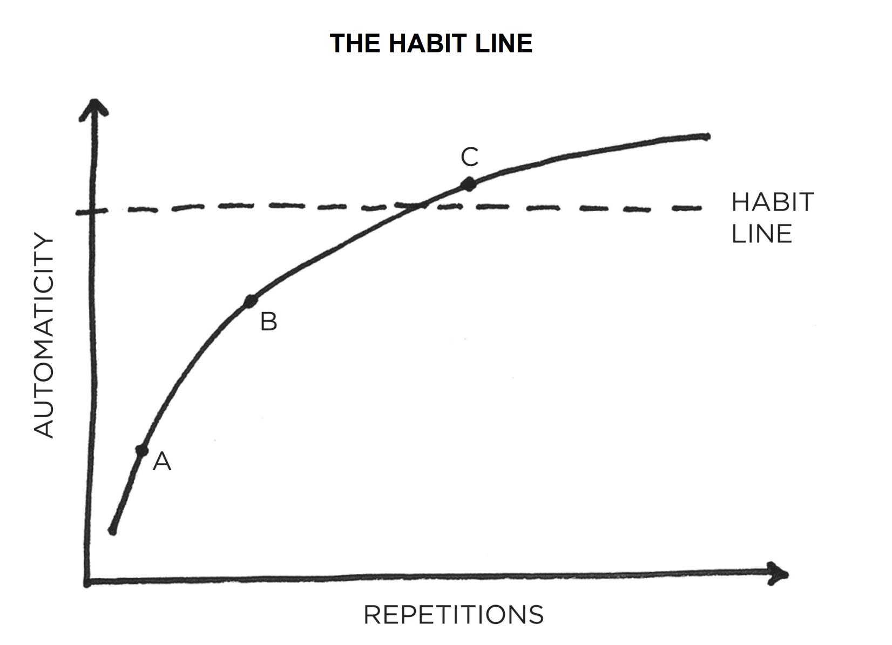

+++
title = "Atomic Habits for Software Developers"
outputs = ["Reveal"]
author = "Mart de Graaf"
+++

### Atomic Habits for Software Developers

Design your habits, just like you design your software

---

## Goal

_inspiring_

---

<section data-noprocess>
    <h2>Books</h2>
    
    
    
</section>

---

## You are what you repeatedly do

---

{}

{}

## B = MAP

Behaviour _happens when_ Motivation x Ability x Prompt _converge at the same moment_.

---

### Fogg behavior Model

--- 

<!-- TODO make the images animated -->

<section data-noprocess>
    
</section>

<section data-noprocess>
    
</section>

{}

---

{}

## Motivation

---

- External Motivation
- Internal Motivation
- Groups

{}

external is bijv: boetes, beloningen, straf, complimenten, etc.

{}

---

## Ability

---

### Make it easy

Make your habits easy to do. The easier it is, the more likely you are to do it.

---

## Prompt

---

### Environment

---

{}

---

{}

## Habit line

---

## Habit line 2

---

## 2-minute rule

Downscale a habit to a 2 minutes version.

{}

“Read before bed each night” becomes “Read one page.”
“Do thirty minutes of yoga” becomes “Take out my yoga mat.”
“Study for class” becomes “Open my notes.”
“Fold the laundry” becomes “Fold one pair of socks.”
“Run three miles” becomes “Tie my running shoes.”

{}

---

## Duolingo

---

## Habit chaining

Chain a habit to a habit you already have.

When [current habit], i start doing [new habit].

{}

---

{}

## Developer habits

---

## Developer behaviors

_could be:_

- Productive
- Effective
- Efficient

---

When I travel to work, I listen to a podcast.

---

Push code to the remote git repository before you finish work.

---

Break down large tasks into smaller tasks.

---

Learn a new thing daily

---

When I start my work, I start with a clean desk.

---

When I attend a meeting, I actively participate or leave.

---

When I do pair programming I offer to Live share my Visual Studio Code session.

---

Before I share my pull request, I review it myself.

---

## 4Dotnet behavior

- Share knowledge
- Kritical
- Ambitious
- Azure knowledge

---

### What habits can you think of?

{}

---

{}

## Architect habits

---

## Architects behaviors

- Responsible
- Explain choices

---

When I go to a conference or meetup, I meet at least 1 new person.

---

Develop a coaching mindset, focusing on guiding others to find solutions rather than providing answers.

---

{}

---

## Tools

Podomoro timer
https://pomofocus.io/

---

## Resources

- https://tinyhabits.com/resources/
